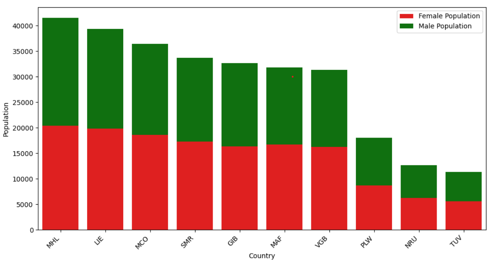

# Prodigy InfoTech Data Science Internship Task 1: 

## Author
Siddhi Vinod Shinde

## Task Objective

Create a bar chart or histogram to visualize the distribution of a categorical or continuous variable using population data.

## Dataset

World Population Dataset (2001–2022)

The dataset contains population records of different countries from 2001 to 2022.

## Tools and Libraries Used

* Python
* Jupyter Notebook
* Pandas
* NumPy
* Matplotlib

## Steps Performed

1. Loaded and explored the dataset.
2. Checked the dataset structure and cleaned missing values if present.
3. Selected the 2022 population data for analysis.
4. Created a bar chart to visualize the population distribution of the top countries.
5. Interpreted the results and compared population trends.

## Visualization

The bar chart represents the population distribution across countries based on the selected year.

## Key Learnings

* Data Cleaning
* Data Visualization
* Exploratory Data Analysis (EDA)
* Working with Population Datasets
* Creating Charts using Python

## Conclusion

This task helped me understand how visualizations can be used to analyze and communicate data effectively. The bar chart provided clear insights into population distribution and improved my practical knowledge of data analysis.

